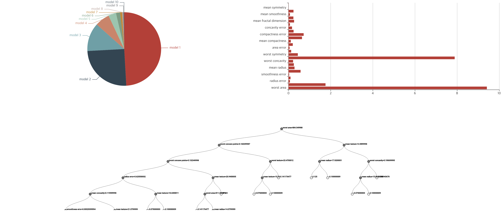
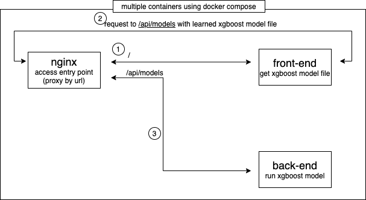

# XGBoost Visualization

* Visualiz
* Feature Importance 

## Tech Stack
* Front-end
  * ReactJS
  * typescript
  * Redux
  * Redux Saga
* Back-end
  * Flask
  * XGBoost
* Docker
  * Docker Compose
* Nginx

## UI

## Architectures

## Run
> docker-compose up --build

## References
* https://xgboost.readthedocs.io/